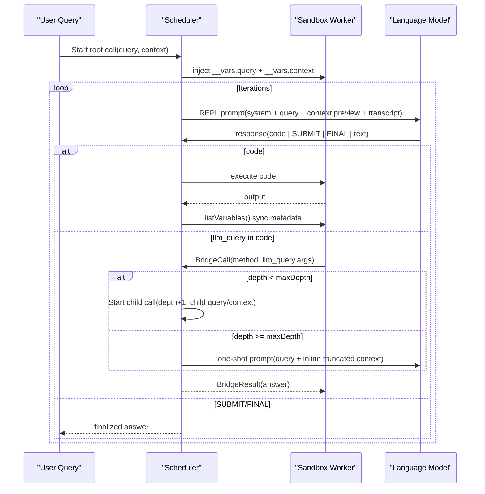

# Recursive Context Surfacing Audit (Multi-Agent Deep Dive)

Date: 2026-02-08  
Workspace: `/Users/pooks/Dev/recursive-llm`

## Scope

Goal: map exactly what is injected into prompts and sandbox state during recursive flow, then identify where context/state visibility can be improved for better reasoning and tool use.

This audit combines:

- direct code-path inspection,
- three parallel explorer-agent passes (prompt shape, recursion propagation, observability surfaces),
- external literature scan for state/memory/control-loop design.

## Current Injection Map

### A) Prompt / State Injection by Stage

| Stage | Where | Injected Into | What is injected | Size/shape behavior |
| --- | --- | --- | --- | --- |
| Call bootstrap | `src/Scheduler.ts` (`handleStartCall`) | Sandbox variable space (`__vars`) | `query`, `context` via `injectAll` | full raw values; no truncation at injection |
| Iterative REPL generation | `src/Scheduler.ts` -> `buildReplPrompt` + `buildReplSystemPrompt` | LLM prompt messages | system protocol + budget + optional tools/output schema; user query; context pointer + preview; transcript replay | context preview hard-capped to 200 chars (`CONTEXT_PREVIEW_CHARS`) |
| Transcript replay | `src/RlmPrompt.ts` + `src/CallContext.ts` | LLM prompt messages | assistant prior response + `[Execution Output]` user turns | execution output truncated earlier to 4,000 chars (`MAX_OUTPUT_CHARS`) |
| Recursive bridge call (`llm_query`) below max depth | `src/sandbox-worker.ts` -> `src/BridgeHandler.ts` -> `src/Scheduler.ts` (`StartCall`) | New child call state + child sandbox | child gets new `query`, optional `context`, fresh iteration/transcript/sandbox | parent vars/transcript not inherited; only query/context argument flows |
| Recursive bridge call at max depth | `src/Scheduler.ts` (`buildOneShotPrompt`) | One-shot child prompt | query + inline `Context: ...` | context truncated to 8,000 chars (`MAX_ONESHOT_CONTEXT_CHARS`) |
| Iteration exhaustion fallback | `src/Scheduler.ts` -> `buildExtractPrompt` + `buildExtractSystemPrompt` | Extract prompt | original query + context-availability note + full transcript replay | context still preview-only in prompt text; transcript replay preserved |
| Post-execution variable sync | `src/Scheduler.ts` (`handleCodeExecuted`) + `src/VariableSpace.ts` | runtime snapshot ref (`variableSnapshot`) | metadata list from `listVariables()` | snapshot updated internally, but not emitted as event and not injected into next prompt |

### B) Depth-Level Visibility Matrix

| Depth scenario | LLM prompt sees | LLM runtime can access in code | Human renderer sees |
| --- | --- | --- | --- |
| Root call (`depth=0`) | system instructions, query, context preview, transcript, budget counters | `__vars.query`, `__vars.context`, derived vars, tools, `llm_query` (if enabled) | call/iteration/model/code/output/final events; depth guides |
| Recursive call (`0 < depth < maxDepth`) | same REPL shape as root but with child query/context | child-local `__vars.*` only (fresh sandbox) | depth shown, bridge marker shown, but no variable snapshot detail |
| Max-depth subcall (`depth >= maxDepth`) | one-shot system + query + inline truncated context | no REPL loop in that subcall path | bridge event and downstream model response only |

## Graphical Flow (Current)

## Key Findings

1. Variable metadata exists but is not surfaced to either the model prompt or renderer events.
   - Snapshot is updated via `VariableSpace.sync`, but `RlmEvent` has no variable-update event type (`src/VariableSpace.ts`, `src/RlmTypes.ts`).
2. Prompt text describes context mostly by pointer/preview; full context is only available if model executes code against `__vars.context`.
   - This is good for context hygiene, but weak for explicit state awareness unless model follows protocol (`src/RlmPrompt.ts`, `src/SystemPrompt.ts`).
3. Child recursion intentionally resets local state (fresh sandbox), so state continuity is only through explicit bridge args.
   - Good isolation, but no first-class call-state summary for the child (`src/Scheduler.ts`, `src/CallContext.ts`).
4. Strict-mode capability mismatch risk.
   - `buildReplSystemPrompt` supports `sandboxMode`, but scheduler call currently omits it, so prompt may over-advertise bridge/tool capability when strict mode disables it (`src/SystemPrompt.ts`, `src/Scheduler.ts`, `src/sandbox-worker.ts`).
5. Context descriptor drift is possible.
   - Prompt continues referencing original `callState.context` length/preview even if code mutates `__vars.context` later.

## Should Full State Be Exposed To The LLM?

Short answer: expose **bounded structured state**, not raw full state dumps.

- Good idea:
  - variable inventory (name/type/size/preview),
  - freshness/version metadata,
  - per-call budget/depth/tool availability,
  - explicit parent/child lineage summary.
- Bad idea:
  - dumping entire variable bodies each turn,
  - replaying full raw context repeatedly,
  - unconstrained growth of state blocks in prompt.

Reason: full dumps increase token load and worsen salience; compact typed summaries improve routing/decision quality with lower prompt noise.

## Literature Signals (Why This Direction Is Sound)

| Work | Relevant signal for this project |
| --- | --- |
| ReAct ([arXiv:2210.03629](https://arxiv.org/abs/2210.03629)) | Interleaving reasoning and environment actions works best when observations are explicit and compact. |
| Toolformer ([arXiv:2302.04761](https://arxiv.org/abs/2302.04761)) | LMs benefit from explicit tool/API call structure rather than implicit latent recall. |
| Lost in the Middle ([arXiv:2307.03172](https://arxiv.org/abs/2307.03172)) | Long-context placement/salience is fragile; keep injected state short and high-signal. |
| Reflexion ([arXiv:2303.11366](https://arxiv.org/abs/2303.11366)) | Verbal/structured feedback loops improve agents when state is explicit between attempts. |
| Tree of Thoughts ([arXiv:2305.10601](https://arxiv.org/abs/2305.10601)) | Branch-aware search performs better with explicit intermediate state evaluation. |
| LATS ([arXiv:2310.04406](https://arxiv.org/abs/2310.04406)) | Agent trajectories benefit from explicit state/action/reward framing. |
| Generative Agents ([arXiv:2304.03442](https://arxiv.org/abs/2304.03442)) | Memory systems improve behavior when retrieval uses distilled summaries, not full transcripts. |

## Effect-Native Design Proposal

### 1) Add a first-class Context Surface service

Create `ContextSurface` (`Context.Tag`) responsible for:

- producing a bounded `PromptStateEnvelope` each iteration,
- injecting it into sandbox as `__vars.__state`,
- optionally adding a compact prompt appendix (`[State Snapshot] ...`) to user message.

Keep this logic out of `Scheduler` branching code and make it composable/testable via `Layer`.

### 2) Introduce typed state models via `Schema`

Define schema-backed models (e.g. in `src/PromptState.ts`):

- `VariableSummary`: `{ name, type, size?, preview, updatedAtIteration }`
- `CallStateSummary`: `{ callId, depth, iteration, parentCallId?, toolNames, budget }`
- `PromptStateEnvelope`: `{ call, variables, freshness, snapshotIteration }`

Use deterministic truncation policy in one place.

### 3) Emit variable/state events

Extend `RlmEvent` with:

- `VariablesUpdated`
- `VariableSyncFailed`
- `PromptStateInjected`

Publish these from the same place that currently runs `vars.sync`, so renderer and telemetry share truth.

### 4) Preserve boundedness by config

Add config controls in `RlmConfig`:

- `stateSurfaceMode`: `"off" | "metadata" | "metadata+preview"`
- `maxPromptStateVars`
- `maxPromptStatePreviewChars`

Default to safe metadata-only mode.

### 5) Make depth behavior explicit

At each child-call start, inject lineage metadata:

- `__vars.__state.parentCallId`
- `__vars.__state.depth`
- `__vars.__state.inheritedContextPolicy` (`"arg-only"` currently)

This keeps recursion transparent without changing isolation.

## Minimal Implementation Sequence

1. Add event types + renderer blocks for variable snapshots (human observability first).
2. Add `ContextSurface` service and envelope injection to `__vars.__state`.
3. Add prompt appendix toggle with strict token cap.
4. Fix strict-mode prompt mismatch by passing `sandboxMode` into `buildReplSystemPrompt`.
5. Add tests:
   - prompt includes state appendix when enabled,
   - state appendix bounded/truncated deterministically,
   - strict-mode prompt advertises no bridge/tools,
   - renderer prints variable snapshot events with depth alignment.

## Net Assessment

Current architecture already follows strong RLM hygiene (variable-space over transcript bloat), but it lacks explicit **state visibility surfaces**. The best Effect-native improvement is to model context-state as a typed, bounded service-backed envelope, emit it as events, and inject a compact view into both `__vars` and optionally the prompt. This improves reasoning and tool routing without regressing token discipline.
